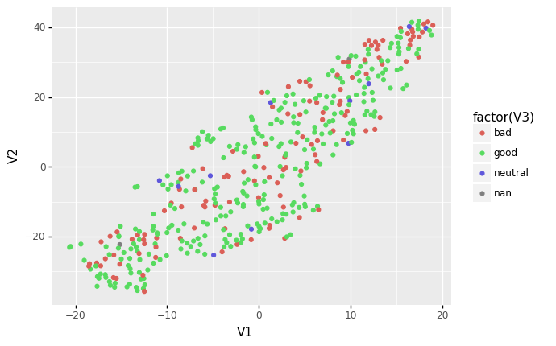

## Q1

```{r warning = FALSE, message = FALSE}
library(tidyverse)
library(gbm)
library(ggfortify)
library(caret)
set.seed(1612)
df <- read_csv("datasets_26073_33239_weight-height.csv") %>%
  mutate(gender_binary = if_else(Gender == "Male", 1, 0))

gbmmodel <- gbm(gender_binary ~ Height + Weight, data = df)

df$gbm_prob <- predict(gbmmodel, df, type = "response")

df <- df %>% mutate(gbmmodel_pred = if_else(gbm_prob > 0.5, 1, 0)) %>% 
  mutate(gbmaccurate = 1*(gbmmodel_pred == gender_binary))

gbmaccuracy <- sum(df$gbmaccurate / nrow(df))
```
```{r}
gbmaccuracy
```
The accuracy of this gbm on this dataset is much better than the gbm on the last homework.

## Q2 

```{r, message = FALSE}
chars <- read_csv("datasets_38396_60978_charcters_stats.csv")
```
We note that there seem to be many rows with 1's in all stats except for power (which has a 0). This seems to be an error, so it makes sense to remove those rows.

```{r}
chars_fixed <- chars %>% filter(!(Total == 5))

pcs <- prcomp(chars_fixed %>% select(-Name, -Alignment))
summary(pcs)
```
Only one principal component is needed to capture 85% of the variance. We argue that there is a need for normalizing the columns, especially the Total column seeing as it operates on a different scale from the rest.

```{r}
scalepcs <- prcomp(chars_fixed %>% select(-Name, -Alignment), scale = TRUE)
summary(scalepcs)
```
Now the first four principal components are needed to capture 85% of the variance.

```{r}
chars_fixed <- chars_fixed %>% mutate(Sum = Intelligence + Strength + Speed + Durability + Power + Combat)
all.equal(chars_fixed$Total, chars_fixed$Sum)
```
It seems that the total column is the sum of the numeric columns. Because of this, it really should not have been included in the PCA. The total column is already a combination of the other variables, thus it already captures a lot of the variation. The largest principal components are almost assuredly due to the total column.

```{r, echo = FALSE}
autoplot(scalepcs, x = 1, y = 2)
```

We find it difficult to draw any specific insights from this plot.

## Q3

Note that the Python code used is provided in this folder as BIOS611HW5.py

```{r}
tsne <- read.table("tsne.txt")
tsne$V3 <- as.factor(chars_fixed$Alignment)
plotted_tsne <- ggplot(tsne) + geom_point(aes(x = V1, y = V2, color = V3))
plotted_tsne
```

There do not appear to be any specific clusters by alignment, perhaps suggesting that the stat distribution is relatively similar between alignments?

## Q4


## Q5

```{r}
tc <- trainControl(method = "repeatedcv", number = 10, repeats = 10)

chars_nonmiss <- chars_fixed %>% drop_na()

gbmcaret <- train(Alignment ~ Intelligence + Strength + Speed + Durability + Power + Combat, data = chars_nonmiss,
                  method = "gbm", trControl = tc, verbose = FALSE)
gbmcaret
```

## Q6

Strategies such as k-fold cross validation are necessary as the accuracy of a model is a random variable (dependent on the random partitioning of the data). In this context, reporting a one-off accuracy statistic does not really make sense. k-fold cross validation and related methods allows us to characterize the expected performance of the model.

## Q7

Recursive feature elimination is an algorithm designed to help choose the predictors for a model. RFE first fits the model using all the predictors and then ranks all the relative importance of every predictor. Then the algorithm refits the model and calculates its performance using the top N predictors, where N ranges from 1 to the maximum number of desired predictors (decided by the user). The algorithm then chooses the value of N which offers the best performance and selects the top N predictors and uses that associated model.