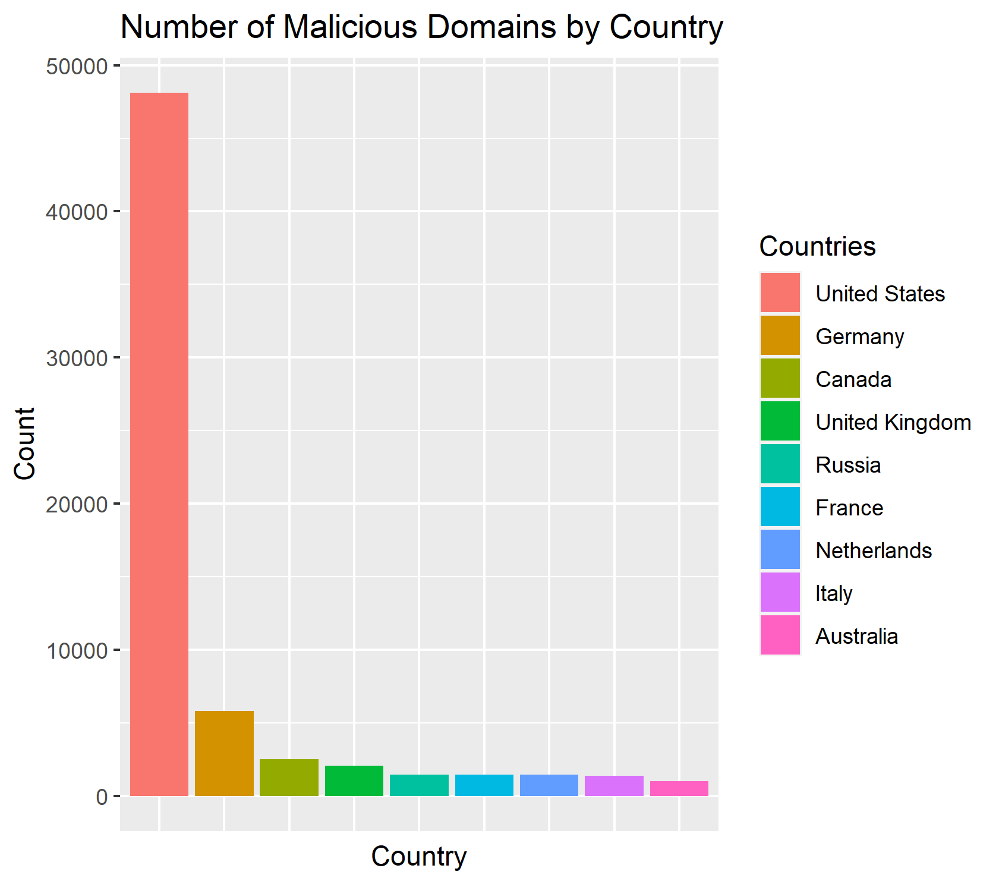
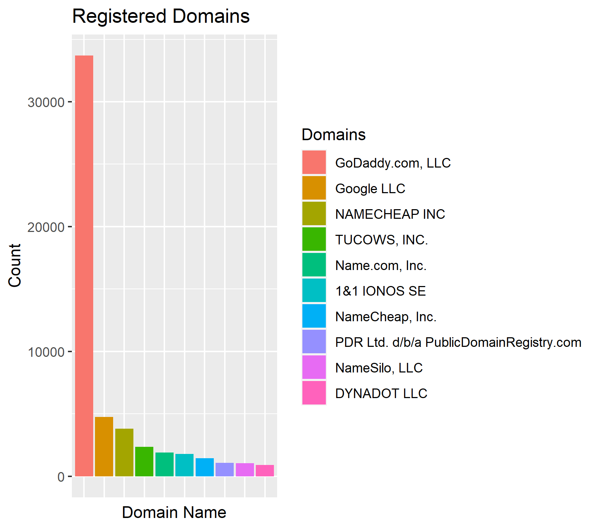

BIOS 611 Project 1
====================

COVID-19 Malicious Websites Dataset
----------------------------------

This repo will eventually contain an analysis of the Malicious Websites Dataset. 

Proposal
--------
Phishing websites and malicious domains in general have been a known danger of the Internet since its inception. Many of these websites utilize various deceptive techniques in order to trick users
into providing sensitive information. One common technique is to impersonate legitimate organizations or companies, such as through well-designed landing pages or URLs that differ only by a single character.
With the advent of the global COVID-19 pandemic, malicious users have taken advantage of the ensuing confusion by creating domains explicitly related to the virus or its ramifications. Analyzing the characteristics
of these newfound COVID-19 malicious domains can give us insight into how phishing websites and malicious users adapt their strategies to reflect current global events.

### Potential Questions

How do these websites attempt to appear legitimate? (string analysis, etc.)  
Where are these domains being hosted? Who are they registered with?  
Is their time of registration in direct response to certain global events?  
Outside of the virus itself, what other aspects do these domains target? (political, conspiracy theories, etc.)

Exploratory Figures
-------------------

Interesting to see the geolocation of these domains, although there is al ot of missing data on this topic.

Perhaps somebody should let GoDaddy know that something shady is going on?

Usage
-----

You'll need Docker and the ability to run Docker as your current user.

You'll need to build the container:

    > docker build . -t project1-env
	
This Docker container is based on rocker/verse. To run rstudio server for a Windows machine through git bash:

    > docker run -v "/$(pwd)":/home/rstudio -p 8787:8787 -e PASSWORD=mypassword -t project1-env
    
Then connect to the machine on port 8787, username is "rstudio".